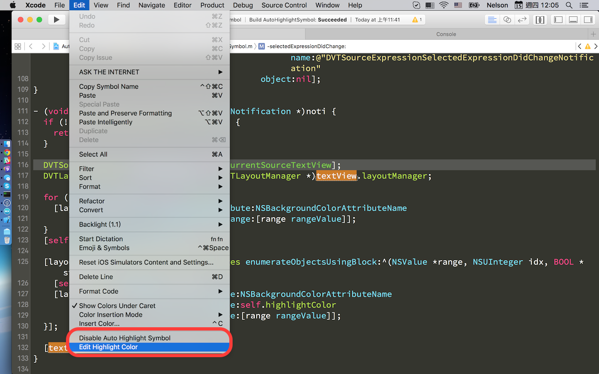

Auto Highlight Symbol
=====================

Xcode can highlight instances of selected symbol, but what it does is to add dash lines under the instances, which is hard to be noticed.

AutoHighlightSymbol is a plugin for Xcode, it adds background highlight color to those instances. It's super useful while you're tracing codes, especially when you want to figure out where a specific varible is used in a certain method.

This plugin is still in early beta, you're welcome to improve it and send me pull requests.

Screenshots
-----------

Installation
------------
- Use [Alcatraz](http://alcatraz.io/) to install and manage plugins, or

- Download the sources, build the project and restart Xcode.
 
- If you encounter any issues you can uninstall it by removing the ~/Library/Application Support/Developer/Shared/Xcode/Plug-ins/AutoHighlightSymbol.xcplugin folder.

Usage
-----
- You need to enable *Highlight instances of selected symbol* option first from *Xcode preferences -> Text Editing*.

- It works with Xcode v7.0.1 (7A1001), read this [wiki document](https://github.com/chiahsien/AutoHighlightSymbol/wiki/Which-version-of-Xcode-does-it-support%3F) if you're using other version of Xcode.

- After installation, you need to enable it from Xcode **[Editor] -> [Enable Auto Highlight Symbol]** menu.

Todo
----
- [x] Integrate into [Alcatraz](http://alcatraz.io/)
- [ ] Better highlight detection mechanism
- [ ] Better highlight rendering mechanism

License
-------
AutoHighlightSymbol is available under the MIT license. See the LICENSE file for more info.

Contact
-------
Any suggestions or improvements are more than welcome. Feel free to contact me at [chiahsien@gmail.com](mailto:chiahsien@gmail.com) or [@NelsonT](https://twitter.com/NelsonT).

Thanks
------
AutoHighlightSymbol cannot be done without these great plugins.

- [SCXcodeMiniMap](https://github.com/stefanceriu/SCXcodeMiniMap)
- [HighlightSelectedString](https://github.com/keepyounger/HighlightSelectedString)
- [XcodeBoost](https://github.com/fortinmike/XcodeBoost)
- [FuzzyAutocompletePlugin](https://github.com/FuzzyAutocomplete/FuzzyAutocompletePlugin)

And these great articles.

- [How To Create an Xcode Plugin](http://www.raywenderlich.com/94020/creating-an-xcode-plugin-part-1)
- [Xcode 4 插件制作入门](http://www.onevcat.com/2013/02/xcode-plugin/)
